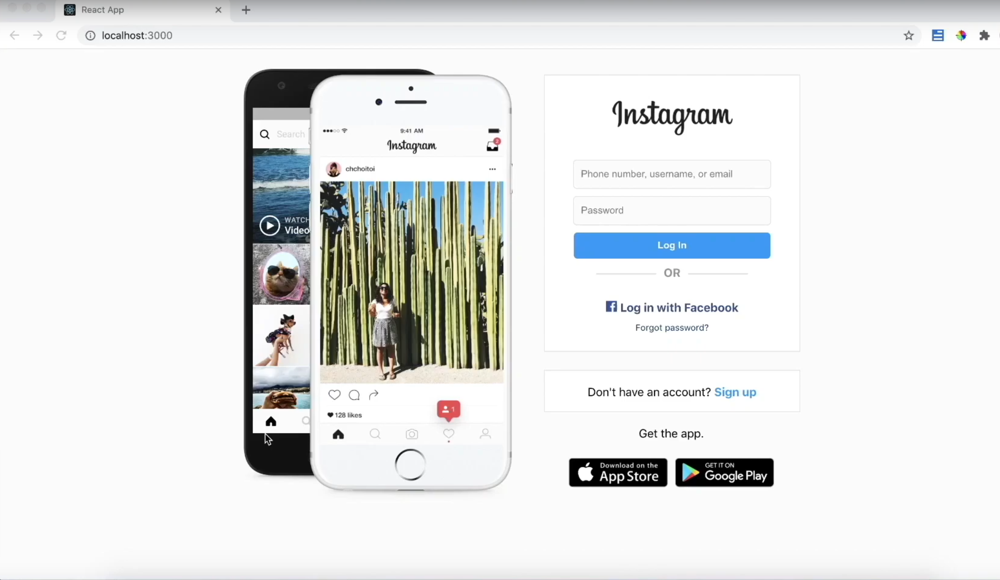
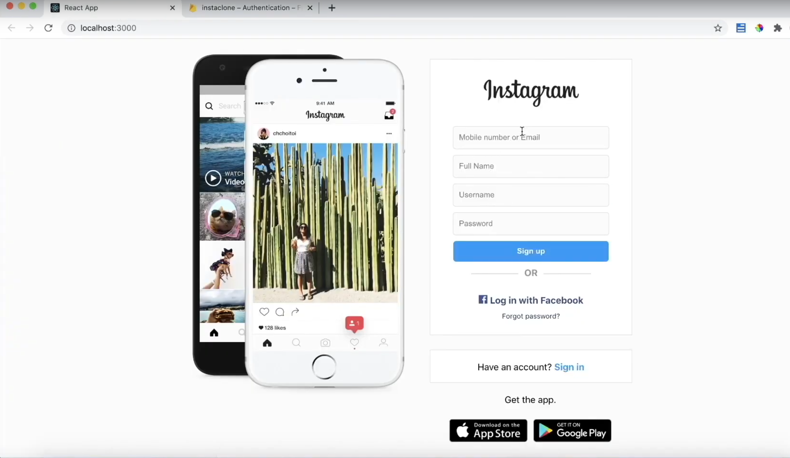
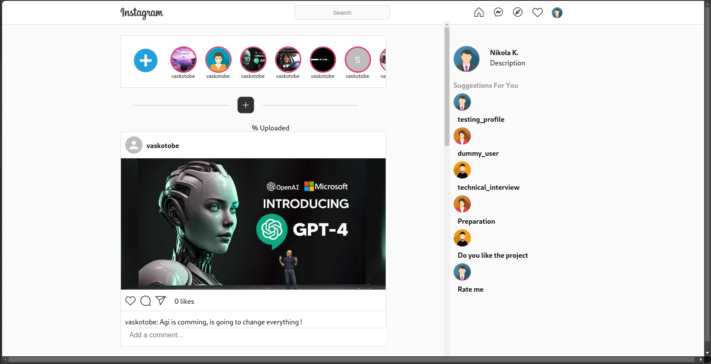
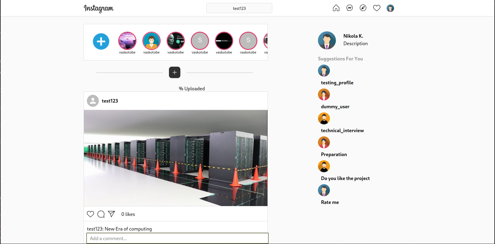

# Instagram-Clone-Backend

This repository contains the backend code for an Instagram clone, designed as a portfolio project to demonstrate backend development skills using Spring Boot and related technologies.

## Project Overview

The Instagram clone backend is designed to support a web application where users can share images and interact through likes and comments, mimicking the functionality of the popular social media platform, Instagram. It utilizes Spring Boot, Spring Security for authentication, and JPA for data persistence.

## Prerequisites
Before setting up the project, ensure you have the following installed:

- **Java SDK: Version 17 or higher**: Version 20.12.2 or higher
- **Maven: Version 3.6 or higher**: Typically comes with Node.js
- **MySQL: Version 8.0 or higher**: Typically comes with Node.js

You can check your Node.js and npm versions by running:

- **java -version**
- **mvn -version**

# Installation
Follow these steps to set up the project locally.

## Step 1: Clone the Repository
- **git clone https://github.com/DAC-hub-101/Instagram-Clone-Frontend.git**

- **cd instagramclone**

## Step 2: Set Up MySQL Database
Create a MySQL database named instagram_clonedb and grant all privileges to a user specific to this database.

## Step 3: Configure Application Properties
Navigate to src/main/resources and update the application.properties file with your specific MySQL user and password:

spring.datasource.username=your_db_username

spring.datasource.password=your_db_password

## Step 4: Build and Run the Application
From the project directory, run the following command to build the application:
mvnw clean install

Then, start the server by running:
mvnw spring-boot:run

The server will start on http://localhost:8080

## Available Scripts 
In the project directory, you can also run:

- **mvnw test**: Executes the test suite.
- **mvnw spring-boot:run**: Starts the application.
- **mvnw clean install**: Build the application.

## Browser Compatibility

The backend API is compatible with any client that supports HTTP requests and respects CORS policies.

## Troubleshooting
If you encounter any issues during installation or running the application, ensure your Java and Maven setups are correctly configured. For database connection issues, verify your MySQL service is running and credentials in application.properties are correct.

## Contributing
Contributions are welcome!

## License
This project is licensed under the GNU General Public License v3.0 - see the [LICENSE](LICENSE) file for details.

## Contact
If you need any help, please contact me at test@example.com

## Login Page:

## Register Page:

## Home Page:

## SearchBar:
